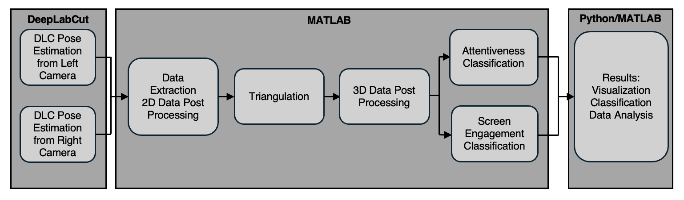

# 🧠 NHP Cognitive State Classification from Stereo Video Data

This repository contains the MATLAB Live Scripts used for processing and analyzing 3D pose data from non-human primates (NHPs) to classify **attentiveness** and **screen engagement** using a video-based behavioral pipeline.

## 📊 Project Summary

This project introduces a novel methodology for classifying cognitive states of NHPs by leveraging DeepLabCut for 2D pose estimation from stereo camera views, MATLAB for 3D triangulation and post-processing, and supervised learning algorithms for behavioral classification. The resulting metrics provide quantifiable insight into NHP attentiveness and touchscreen engagement across trials and tasks in a modular kiosk system.

---

## 🧬 Pipeline Overview

The full data analysis pipeline is shown in the figure below:

1. **DeepLabCut (DLC)**:
   - 2D pose estimation from synchronized left and right camera footage.
2. **MATLAB**:
   - 2D data extraction and post-processing.
   - Triangulation for 3D reconstruction.
   - 3D data post-processing and feature engineering.
   - Attentiveness and screen engagement classification.
3. **Python/MATLAB**:
   - Visualization, classification, and statistical data analysis.

---

## 📁 Repository Contents

| File | Description |
|------|-------------|
| `Preparation1.mlx`       | Loads and filters the raw 2D DLC pose data for both camera views, applies outlier removal and interpolation. |
| `DataConversion2.mlx`    | Performs triangulation and 3D reconstruction of NHP pose data using calibrated stereo camera parameters. |
| `Attentiveness4.mlx`     | Computes head pose angles (pitch, yaw) and classifies attentiveness based on individualized angular thresholds. |
| `ScreenEngagement3.mlx`  | Calculates wrist-to-screen distances and classifies screen engagement events across time. |
| `VisualizeData5.mlx`     | Provides time-series plots, task-based breakdowns, and classification window visualizations. |

---

## 📥 Data Input Requirements

- Exported 2D pose `.csv` files from DeepLabCut for **left** and **right** camera views.
- Stereo camera calibration file: `stereoParams.mat` (generated using MATLAB Stereo Camera Calibrator Toolbox).

---

## ⚙️ How to Run

1. **Clone the repository**

2. **Open MATLAB**, and run the scripts in order:
   1. `Preparation1.mlx`
   2. `DataConversion2.mlx`
   3. `Attentiveness4.mlx`
   4. `ScreenEngagement3.mlx`
   5. `VisualizeData5.mlx`

3. Optionally, load pre-processed results from `Bard.mat` for quick visualization or analysis.

---

## 📈 Classification Details

- **Attentiveness**:
  - Based on pitch and yaw angles from head pose estimation (nose and eye landmarks).
  - Binary classification: Attentive vs. Inattentive.
- **Screen Engagement**:
  - Based on wrist proximity to the screen in 3D space.
  - Binary classification: Engaged vs. Disengaged.
- Thresholds are customizable per subject based on behavior patterns.
- Results can be visualized by time window, trial, or task.

---

## 📚 Citation

If you use this pipeline, please cite:

> Cheung, S. M., Neumann, A., & Womelsdorf, T. *Inferring Cognitive States of Non-human Primates using Deep-Learning based Action Recognition from Video*. [In preparation].

---

## 🧠 Acknowledgments

- Vanderbilt University, Attention Circuit Control Lab led by Dr. Womelsdorf
- DeepLabCut by Mathis et al. (2018)  
- Camera hardware by White Matter LLC

---
